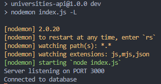

# University API

Uma API para armazenar universidades no banco de dados MongoDB.

## 🚀 Começando

Essas instruções permitirão que você obtenha uma cópia do projeto em operação na sua máquina local para fins de consulta, desenvolvimento e teste.

### 📋 Pré-requisitos

- **[Node v16.17.0](https://nodejs.org/en/)**
- **[Postman](https://www.postman.com/)**

Para verificar se o node foi instalado corretamente:

```
node -v
```

### 🔧 Instalação

Com o repositório já baixado no seu local, agora é necessário instalar as dependências.

Abra um terminal na raiz projeto e digite:

```
npm install
```

Aguarde todos os pacotes serem instalados.

Para o projeto, é necessário ter as credências de acesso ao banco de dados, estarei disponibilizando aos interessados que entrarem em contato comigo pelo [linkedin](https://www.linkedin.com/in/iohara-pereira/).
[ENV](https://drive.google.com/file/d/1vXt9hz7A-ugBF4KDrWnh2y3lw6zdckvF/view?usp=sharing) 
Acima segue o .env (ficará temporariamente). Coloque na raiz do projeto.
Com as credencias já instaladas, siga no terminal:

```
npm run dev
```

Aguarde o projeto iniciar na porta 3000, então certifique-se que esteja livre.



## ⚙️ Executando os testes

Para executar os testes, siga no terminal:

```
npm run test
```

### 🔩 Cobertura dos testes.

No momento, foram adicionados testes para o repository.

## 📦 Implantação

Este projeto foi implantando no Amazon Elastic Compute Cloud - [EC2](https://aws.amazon.com/pt/ec2/). Foi utilizado um gerenciador de processos para o tempo de execução JavaScript Nodejs, o [PM2](https://www.npmjs.com/package/pm2). Você pode verificar a versão pública [aqui](18.208.177.17:3000/universities).

## 🛠️ Construído com

- [Express](https://expressjs.com/pt-br/) - O framework web usado
- [MongoDB](https://www.mongodb.com/lp/video/awareness/getting-started?utm_content=rlsapostreg&utm_source=google&utm_campaign=search_gs_pl_evergreen_atlas_general_retarget-brand-postreg_gic-null_amers-all_ps-all_desktop_eng_lead&utm_term=&utm_medium=cpc_paid_search&utm_ad=&utm_ad_campaign_id=14412646452&adgroup=131761126212&gclid=CjwKCAjwpqCZBhAbEiwAa7pXedwJqkButwAS3Ck3hGFcLehsnzR1ivaqcatQRRYFPXeb-dbcHXkNMxoC_PoQAvD_BwE) - Banco de dados NoSQL
- [Mongoose](https://mongoosejs.com/) - ODM para o MongoDB
- [Mockingoose](https://github.com/alonronin/mockingoose) - Pacote Jest para modelos mongoose

## ⚙️ Consultando os endpoints

A aplicação consiste em quatro operações básicas na bases de dados, um [CRUD](https://coodesh.com/blog/dicionario/o-que-e-crud/).

Com o Postman instalado, você pode executá-los.

### Create

```
POST: localhost:3000/universities
```

No body da requisição em raw este é o modelo em JSON para ser enviado:

```
{
  "domains": [
    "universidade.edu.br"
  ],
  "alpha_two_code": "BR",
  "web_pages": [
    "http://www.universidade.edu.br/"
  ],
  "name": "Universidade C",
  "country": "Brazil",
  "state-province": "São Paulo"
}
```

### Read

```
GET: localhost:3000/universities
```

Você também pode adicionar Params a essa requisição.

| Key     | Value              |
| ------- | ------------------ |
| country | [país]             |
| page    | [número da página] |

Você também pode consultar uma universidade específica.

```
GET: localhost:3000/universities/[id]
```

### Update

```
UPDATE: localhost:3000/universities/[id]
```

No body da requisição em raw este é o modelo em JSON para ser enviado:

```
{
  "web_pages": [
    "http://www.universidade.edu.br/"
  ],
  "name": "Universidade D",
  "domains": [
      "universidade.edu.br"
  ]
}
```

### Delete

```
DELETE: localhost:3000/universities/[id]
```

Alguma dúvida? Entre em contato comigo: iohara.pereira@hotmail.com

⌨️ com ❤️ por [Iohara](https://github.com/Iohara1997) 😊
